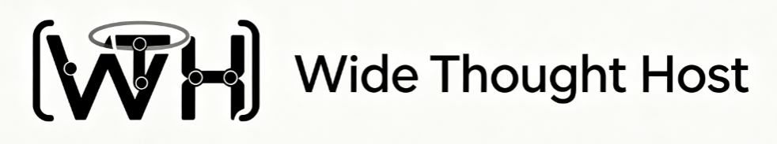

<div align="center">



**Open-source AI coding agent — CLI + Desktop. Multi-model, extensible, privacy-first.**

A from-source customization of the [Grok Build](https://github.com/xai-org/grok-build) /
[gork-build](https://github.com/thedavidweng/gork-build) agent runtime, re-engineered
for multi-model support, a polished desktop GUI, and deep extensibility.

[Features](#features) ·
[Quick start](#quick-start) ·
[Desktop app](#desktop-app) ·
[Configuration](#configuration) ·
[Contributing](#contributing)


---

**Wide Thought Host (WTH)** is a coding agent harness — a fullscreen TUI + desktop GUI for
interacting with LLMs to write, refactor, and understand code. Supports multiple LLM backends,
a rich plugin ecosystem, and deep shell/tool integration.

</div>

## Features

- **Multi-backend LLM support:** OpenAI-compatible APIs, Anthropic Claude,
  DeepSeek, local models (Ollama / vLLM) — pluggable and customizable.
- **Desktop GUI:** Tauri v2 desktop app with multi-session chat, file tree,
  embedded terminal, and system tray. Windows installer with Chinese localization.
- **Fullscreen TUI:** ratatui-based terminal interface with mouse support,
  syntax-highlighted diffs, multi-panel layout, and customizable themes.
- **Rich tool ecosystem:** bash/shell, file operations, LSP integration, git,
  MCP protocol, web search — all with fine-grained permission control.
- **Agent optimization:** intelligent context-window management, prompt
  caching, multi-step plan-execute-verify loops, sub-agent delegation.
- **Plugin system:** hook-based extensibility, slash commands, custom tool
  registration.
- **Privacy-first:** no vendor telemetry, no research uploads, no auto-update
  channels — you control every byte that leaves your machine.

## Quick start

### CLI (TUI)

```sh
# Requirements: Rust (see rust-toolchain.toml), protoc
cargo run -p wth-pager-bin              # build + launch TUI (binary: wth)
cargo build -p wth-pager-bin --release  # target/release/wth

# Headless mode
wth --headless --prompt "Explain the architecture of this project"

# Use a specific backend
wth --backend anthropic --model claude-sonnet-4-20250514
```

### Desktop app

```sh
cd crates/desktop/wth-desktop
npm install
npm run tauri dev     # development
npm run tauri build   # production build → target/release/bundle/
```

The desktop app starts with **Alt+W** (toggle window visibility) and lives in the system tray.

## Configuration

```toml
# ~/.wth/config.toml
[backends.openai]
api_base = "https://api.openai.com/v1"
api_key_env = "OPENAI_API_KEY"
default_model = "gpt-4.1"

[backends.anthropic]
api_key_env = "ANTHROPIC_API_KEY"
default_model = "claude-sonnet-4-20250514"

[ui]
theme = "dark"          # dark | light | solarized
default_panels = ["chat", "diff", "terminal"]

[agent]
max_context_tokens = 128000
cache_prompts = true
subagent_delegation = true
```

## Project structure

```
crates/
├── codegen/          # Core agent & TUI crates (wth-agent, wth-pager, wth-tools, ...)
├── common/           # Shared libraries (tool protocol, runtime, tracing, ...)
├── build/            # Build support (proto generation)
├── desktop/          # Tauri desktop app (wth-desktop)
third_party/          # Vendored dependencies
docs/                 # Documentation & specs
```

## Contributing

Contributions are welcome. See [`CONTRIBUTING.md`](CONTRIBUTING.md) for setup,
commit conventions, and PR expectations. Security reports: [`SECURITY.md`](SECURITY.md).

## Relationship to upstream

This project is a customized distribution derived from:

- [`xai-org/grok-build`](https://github.com/xai-org/grok-build) — the original
  SpaceXAI coding agent harness (Apache-2.0)
- [`thedavidweng/gork-build`](https://github.com/thedavidweng/gork-build) — a
  community fork with vendor telemetry removed

Wide Thought Host (WTH) extends this foundation with multi-backend support,
enhanced agent reasoning, an improved TUI experience, and a full desktop GUI.

**Credit:** original Grok Build is developed and published by SpaceXAI under
Apache-2.0. Gork Build is a community distribution. WTH is an independent
project and is **not** affiliated with, endorsed by, or sponsored by SpaceXAI,
xAI, or the Gork Build contributors. Grok, Grok Build, xAI, and SpaceXAI are
trademarks of their respective owners.

## License

Apache License 2.0 — see [`LICENSE`](LICENSE) and attribution in [`NOTICE`](NOTICE).

Upstream copyright (SpaceXAI) is retained as required by Apache-2.0. Community
modifications are copyright the Wide Thought Host contributors.

## Security

Please do **not** open public issues for security reports that include secrets.
See [`SECURITY.md`](SECURITY.md).
