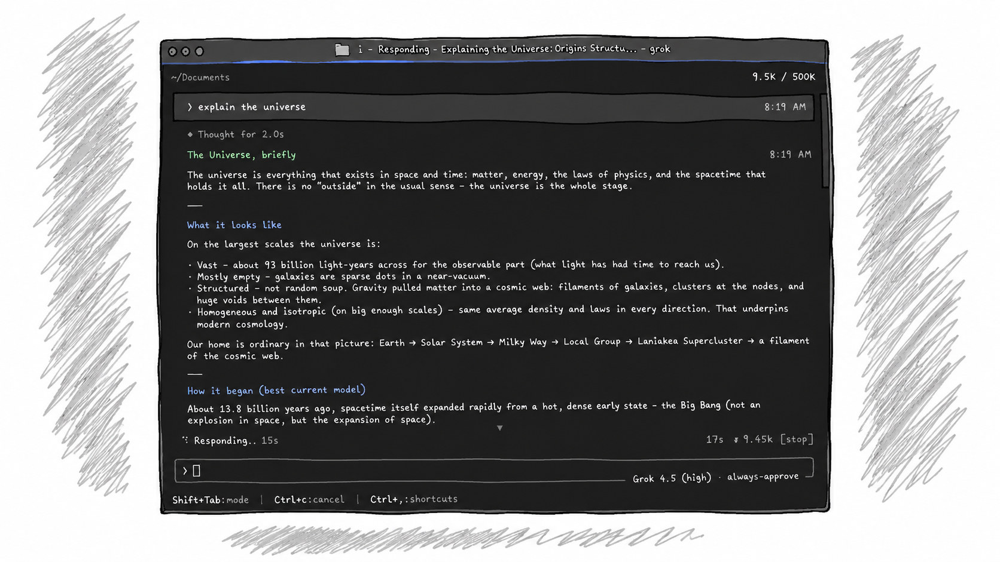

<div align="center">


# Wide Thought Host (WTH)

**开源 AI 编程代理 — CLI (TUI) + 桌面 GUI。多模型、可扩展、隐私优先。**

    

[✨ 特性](#-特性) · [🚀 快速开始](#-快速开始) · [📦 安装与部署](#-安装与部署) · [⚙️ 配置](#-配置) · [📚 项目结构](#-项目结构) · [❓ FAQ](#-faq) · [🤝 贡献](#-贡献)

</div>

**Wide Thought Host (WTH)** 是一个 AI 编码代理平台，提供**全屏终端 TUI** 与 **Tauri 桌面 GUI** 双形态，用于与 LLM 交互完成代码编写、重构与理解。支持多种 LLM 后端、丰富的工具生态与深度 Shell 集成。

本项目基于 [Grok Build](https://github.com/xai-org/grok-build)（Apache-2.0）从源码定制，重新设计了多模型支持、桌面 GUI 与可扩展性。



---

## ✨ 特性

| 领域 | 能力 |
|------|------|
| **多后端 LLM** | OpenAI 兼容 API、Anthropic Claude、DeepSeek，桌面端一键检测本地模型（Ollama / vLLM，无需 API Key），可插拔自定义 |
| **桌面 GUI** | Tauri v2 多会话聊天、文件树、内置终端、系统托盘、Windows 安装包（中英双语） |
| **全屏 TUI** | ratatui 终端界面：鼠标支持、语法高亮 Diff、多面板布局、自定义主题 |
| **工具生态** | Shell/Bash、文件操作、LSP 集成、Git、MCP 协议、Web 搜索，全部带细粒度权限控制 |
| **Agent 优化** | 智能上下文管理、提示词缓存、计划-执行-验证多步循环、子代理委派 |
| **插件系统** | Hook 扩展、斜杠命令、自定义工具注册、插件市场 |
| **隐私优先** | 无厂商遥测、无研究上传、无自动更新通道——你控制每字节离开机器的数据 |

### 桌面端亮点

- **多会话管理**：新建 / 重命名 / 固定 / 删除，会话持久化到本机
- **Monaco 代码编辑器** + **Diff 审查**（逐块确认/拒绝，支持撤销）
- **编辑模式**：Plan / Review / Auto / YOLO 四种审批策略
- **子智能体委派**：输入 `@` 并行处理任务，结果回传主会话
- **DAG 工作流编排**：内置"审查流水线"模板，顺序/依赖/条件节点
- **记忆系统**：Agent 长期记忆按相关性自动注入（最多 20 条）
- **技能 (Skills)**：`~/.wth/skills` 下的 `SKILL.md` 可作为斜杠命令注入
- **Hook 生命周期**：`message_sent` / `agent_response_done` / `tool_approved` / `tool_denied`
- **工作区检索**：关键词评分 + Ollama 语义检索自动升级
- **网络韧性**：代理模式、超时配置、失败自动重试
- **备份与恢复**：一键打包/恢复（`.wthbackup`），配置导入导出

---

## 🚀 快速开始

### CLI (TUI)

```sh
# 环境要求：Rust（见 rust-toolchain.toml）、protoc
cargo run -p wth-pager-bin              # 构建并启动 TUI（二进制名：wth）
cargo build -p wth-pager-bin --release  # target/release/wth

# 无头单轮模式（打印响应后退出）
wth -p "Explain the architecture of this project"

# 指定模型
wth -m claude-sonnet-4-20250514

# 指向任意 OpenAI 兼容端点（OpenAI、DeepSeek、Ollama、vLLM ...）
WTH_API_BASE_URL=http://localhost:11434/v1 WTH_API_KEY=... wth -p "hello"
```

### 桌面端开发

```sh
cd crates/desktop/wth-desktop
npm install
npm run tauri dev     # 开发模式（热重载）
npm run tauri build   # 生产构建 → target/release/bundle/
```

> 桌面应用默认 **Alt+W** 切换窗口显隐，常驻系统托盘。

---

## 📦 安装与部署

### Windows 安装包

从 [GitHub Releases](https://github.com/Wan-1230/Wide-Thought-Host/releases) 下载：

| 格式 | 文件 | 说明 |
|------|------|------|
| NSIS | `Wide Thought Host_<version>_x64-setup.exe` | 轻量安装向导，推荐 |
| MSI | `Wide Thought Host_<version>_x64.msi` | 企业批量部署 / 组策略分发 |

**依赖**：Windows 10/11 x64 + [WebView2 Runtime](https://developer.microsoft.com/microsoft-edge/webview2/)（安装程序会自动引导下载）。

**注意事项**：
- 当前安装包**未做代码签名**，SmartScreen 可能提示"未知发布者"——选择"更多信息 → 仍要运行"即可。
- 商业签名证书采购后此提示将消失。

### 从源码构建桌面端

```sh
# 前置依赖：Rust 1.92+、Node.js 20+、protoc
git clone https://github.com/Wan-1230/Wide-Thought-Host.git
cd Wide-Thought-Host/crates/desktop/wth-desktop

npm install
npm run tauri build          # 生成 NSIS + MSI 安装包
# 产物位置：target/release/bundle/
```

### 发布自动化

打 `v*` tag 会自动触发 GitHub Actions：

- `ci.yml` — 全工作区 fmt / clippy / test
- `desktop-ci.yml` — 桌面端测试 + NSIS/MSI 打包 + **自动创建 GitHub Release**

```sh
git tag v1.0.0
git push origin v1.0.0
```

---

## ⚙️ 配置

### 配置文件位置

| 路径 | 说明 |
|------|------|
| `~/.wth/config.toml` | 主配置（或 `$WTH_HOME/config.toml`） |
| `~/.wth/skills/` | 用户技能（每个技能一个 `SKILL.md`） |
| `~/.wth/plugins/` | 用户插件（`plugin.json` + `skills/` + `hooks/`） |
| `~/.wth/sessions.json` | 会话持久化数据 |

### 配置示例

```toml
# ~/.wth/config.toml  (或 $WTH_HOME/config.toml)
[endpoints]
# 任意 OpenAI 兼容端点。环境变量等价：WTH_API_BASE_URL / GROK_XAI_API_BASE_URL
# xai_api_base_url = "https://api.openai.com/v1"
# models_base_url = "https://api.openai.com/v1"

[ui]
theme = "dark"          # dark | light | solarized | custom
default_panels = ["chat", "diff", "terminal"]

[agent]
# Agent 定义选择：内置名称或带 YAML frontmatter 的 .md 文件
# name = "grok-build"
# definition = "$HOME/.wth/agents/my-agent.md"
```

### 环境变量

| 变量 | 用途 |
|------|------|
| `WTH_API_BASE_URL` | OpenAI 兼容 API 基地址 |
| `WTH_API_KEY` | API 密钥 |
| `WTH_HOME` | 自定义 WTH 数据目录（默认 `~/.wth`） |

---

## 📚 项目结构

```
crates/
├── codegen/          # 核心 Agent 与 TUI crates（wth-agent, wth-pager, wth-tools, ...）
├── common/           # 共享库（工具协议、运行时、tracing, ...）
├── build/            # 构建支持（proto 生成）
├── desktop/          # Tauri 桌面应用（wth-desktop）
third_party/          # 依赖 vendoring
docs/                 # 文档与规格
docs/user-guide/      # 用户手册（快速上手、功能总览、设置说明、常见问题、隐私说明）
```

更多细节见 [`docs/user-guide/`](docs/user-guide/)。

---

## ❓ FAQ

### 模型连接失败怎么办？

1. **设置 → 模型与 API → 测试连接**，确认 Base URL 与 API Key 正确。
2. 检查网络：**设置 → 通用 → 网络 → 代理模式**。使用代理软件时选"自定义"填地址，或选"系统代理"。
3. 连接超时过短可调大（范围 5~120 秒）。

### 请求报错 401 / 403？

API Key 无效或额度用尽。在设置页重新填写该模型的 API Key（存于 Windows 凭据管理器）。

### 安装后无法启动 / 闪退？

1. 确认已安装 [WebView2 Runtime](https://developer.microsoft.com/microsoft-edge/webview2/)。
2. 查看**设置 → 诊断**的最近日志与实时日志。
3. 在安装目录命令行运行 `wth-desktop.exe` 查看错误输出。

### 如何添加自定义模型？

**设置 → 模型与 API → 添加模型**，填写名称、模型 ID、Base URL 与 API Key（如 OpenAI、DeepSeek 等 OpenAI 兼容端点），点击"设为默认"。

**用本地模型？** 点击同一页的**「检测本地模型」**，自动发现本机 Ollama（11434）或 vLLM（8000）并加入模型列表——本地模型无需 API Key，数据不出本机。

### 如何安装技能或插件？

- **技能**：将 `SKILL.md` 放入 `~/.wth/skills/<技能名>/`，重启后在输入框键入 `/` 即可作为斜杠命令调用。
- **插件**：放入 `~/.wth/plugins/<插件名>/`（含 `plugin.json`），或在设置页从远程插件市场一键安装。

### 如何把 WTH 工作区接入其他 AI 工具（MCP）？

运行 `wth mcp-serve --root <工作区路径>`，即可把工作区以 **MCP 服务器**
（stdio，2025-06-18 规范）暴露给 VS Code、Claude Desktop 或任何 MCP 客户端：
提供 `wth_read_file` / `wth_list_dir` / `wth_grep` 只读工具与
`wth_ask`（把问题交给 WTH Agent 完整工具生态回答）。所有路径访问严格
限制在工作区内。

### 桌面端与 CLI 的关系？

当前两者是**独立实现**：桌面端是带工具调用与审批的多后端聊天客户端（文件读写、终端、MCP、子智能体、DAG 工作流、技能）；CLI/TUI 承载完整 Agent 工具生态（沙箱、LSP、计划模式、Hooks、插件市场）。桌面端经 ACP 接入 CLI 统一内核在优化路线图 v1.2 推进，详见 [`docs/WTH-优化PRD.md`](docs/WTH-优化PRD.md) A-01。

### 数据会发送到哪里？

默认只发送到你配置的 LLM 端点。项目无厂商遥测、无研究上传。详见 [`PRIVACY.md`](PRIVACY.md)。

---

## 🤝 贡献

欢迎贡献！参见 [`CONTRIBUTING.md`](CONTRIBUTING.md)（环境搭建、提交规范、PR 要求）。安全报告请走 [`SECURITY.md`](SECURITY.md)，不要公开提交含密钥的 issue。

## 与上游的关系

本项目是从以下项目派生的定制发行版：

- [`xai-org/grok-build`](https://github.com/xai-org/grok-build) — 原始 SpaceXAI 编码代理框架（Apache-2.0）
- [`thedavidweng/wth-build`](https://github.com/thedavidweng/wth-build) — 移除厂商遥测的社区分支

WTH 在此基础之上扩展了多后端支持、增强的 Agent 推理、改进的 TUI 体验与完整桌面 GUI。

**致谢**：原始 Grok Build 由 SpaceXAI 在 Apache-2.0 下开发与发布。WTH Build 是社区发行版。WTH 是独立项目，与 SpaceXAI、xAI 或 WTH Build 贡献者**无隶属、背书或赞助关系**。Grok、Grok Build、xAI、SpaceXAI 均为其各自所有者的商标。

## 许可证

Apache License 2.0 — 见 [`LICENSE`](LICENSE) 与 [`NOTICE`](NOTICE) 中的署名信息。

上游版权（SpaceXAI）按 Apache-2.0 要求保留。社区修改版权归 Wide Thought Host 贡献者所有。

## 安全

请勿公开发布包含密钥的安全报告。参见 [`SECURITY.md`](SECURITY.md)。
